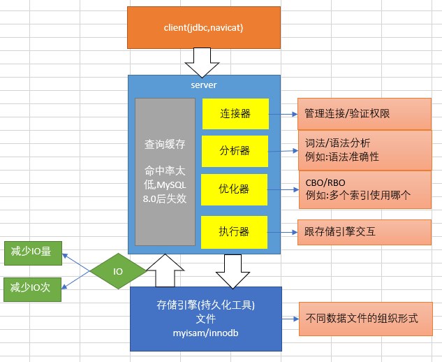

# MySQL

## 结构图



## 索引
### 索引介绍
- 索引是什么
    - 索引是帮助MySQL高效获取数据的数据结构
    - 索引存储在文件系统中
    - 索引的文件存储形式与存储引擎有关
    - 索引文件的结构
        - hash
        - 二叉树
        - B树
        - B+树

### 索引文件的结构
- hash表存储
    - 利用hash存储的话需要将所有的数据文件添加到内存中,比较耗费空间
    - 如果所有查询是等值查询,那么hash确实很快,但是在实际环境中范围查找更多,而不是等值查询
    - 无论是二叉树或者红黑树的索引格式,都会因为树的深度造成IO次数变多,影响读取效率

- B树
    - 所有的键值分布在整棵树中
    - 搜索有可能在非叶子节点结束,在关键字全集内做一次查找,性能逼近二分查找
    - 根节点最少两颗子树
    - 每个节点最多拥有m个子树
    - 分枝结点至少拥有m/2个子树(除根节点和叶子节点外都是分支节点)
    - 说明
        - 键值:表中记录的主键
        - 指针:存储子节点地址信息
        - 数据:表中除主键外的数据
    
- B+树
    - B树基础上做了一种优化
    - B+树每个节点可以包含更多的节点,原因有二,其一降低树的高度,其二数据范围变为多个区间,区间越多,数据检索越快
    - 非叶子节点存储key,叶子节点存储key+data
    - 叶子节点两两指针互相连接(符合磁盘预读特性),顺序查询性能更高
    - B+树两个头指针,一个执行根节点,另一个执行关键字最小的叶子节点,而且所有叶子节点(即数据节点)之间是一种链式环结构,因此可以对B+树进行两种运算:一种是对于主键的范围查找和分页查找,一种是从根节点开始,进行随机查找
    - 说明
        - Innodb
            - 聚簇索引:索引和数据在一起
            - 指针:表中记录的主键
            - 键值:存储子节点的地址信息
            - 数据:表记录中除主键外的数据
            - innodb是通过B+树结构对主键创建索引,然后叶子节点存储记录,如果没有主键,那么就选唯一键,没有唯一键,那么会生成一个6位的rowId来作为主键
            - 如果索引创建的键是其他字段,那么叶子节点中存储的是该记录的主键,然后在通过主键索引找到对应的记录
        - MyISAM
            - 非聚簇索引:索引和数据分开
            - 键值:存储子节点的地址信息
            - 数据:记录的地址值        
            
### 索引的分类

- 索引的五种类型
    - 主键索引
        - 主键是唯一性索引,但必须指定为PRIMARY KEY,每个表只能有一个主键
    - 唯一索引
        - 索引列的所有值只能出现一次,但必须唯一,可为空
    - 普通索引
        - 基本索引类型,值可以为空,没有唯一性限制
    - 全文索引
        - 全文索引类型为FULLTEXT,全文索引可以在varchar,char,text类型的列上创建
    - 组合索引
        - 多列值组成一个索引,专门用于组合索引

### 相关名词

- 表中三个字段,ID,NAME,AGE 其中 ID是主键 NAME是普通索引

<table>
    <tr>
        <td>id</td>
        <td>name</td>
        <td>age</td>
    </tr>
    <tr>
        <td>1</td>
        <td>a</td>
        <td>18</td>
    </tr>
    <tr>
        <td>2</td>
        <td>b</td>
        <td>19</td>
    </tr>
</table>

- 回表
    - 当使用其他索引的时候,叶子节点并不包含整行的数据值,需要去主键索引中进行数据查找的过程叫回表
    - select id,name,age where name = ?;
    
- 覆盖索引
    - 当普通的B+树中包含要查询的所有字段时,可以不用回表,此时称为覆盖索引
    - - select id,name where name = ?;

- 最左匹配原则
    - 适用于组合索引的情况(假设name,age组合索引),必须先匹配第一个列,然后匹配第三个列
    - select id,name,age where name= ? and age = ?; 可以匹配
    - select id,name,age where age= ? and name = ?; 可以匹配
    - select id,name,age where name= ?; 可以匹配,name是最左边
    - select id,name,age where age = ?; 不可以匹配,不符合最左原则

- 索引下推
    - MySQL5.7的特征,原来在server层做得过滤操作下推到存储引擎完成
    - 5.7之前,先根据name的值去存储引擎中把数据取出来,然后在server层做age条件过滤
    - 5.7以及之后,根据name和age两个列的值去存储引擎中进行数据筛选,不需要在server层条件过滤了
    - select id,name,age where name= ? and age = ?; 5.7之前是在server层条件过滤,之后存储引擎层过滤
    

- OLAP
    - 联机分析处理
    - 对海量历史数据进行分析操作,要求产生决策性的影响,不要求极短时间返回结果
    - 应用于数据仓库(hive)

- OLTP
    - 联机事务处理
    - 为了支撑业务系统的需要,必须在极短的时间内返回对应的结果
    - 关系型数据库(mysql)

## 事务

### MVCC多版本并发控制

- 基础知识
    - 当前读
        - 读取的是最新的版本,总是读取最新的数据
        - select ... lock in share mode;
        - select ... for update;
        - update/delete/insert
    - 快照读
        - 读取的是历史版本的记录
        - select ...
    - 隔离级别
        - 读未提交
        - 读已提交(ORACLE默认),简称RC
        - 可重复读(MySQL默认),简称RR
        - 串行化
    - 隐藏字段,每一行记录上都会包含几个用户不可见的字段
        - DB_TRX_ID:创建或最后一次修改记录的事务ID
        - DB_ROW_ID:隐藏主键
        - DB_ROW_PTR:回滚指针,配合undolog回滚
    - undolog
        - 回滚日志,记录历史版本
        - 当不同的事务,对同一条记录做修改的时候,会导致该记录的undolog形成一个线性表,也就是链表,链首是最新的历史记录,而链尾是最早的历史记录
    - readview
        - 事务在进行快照读的时候产生的读视图
        - TRX_LIST:系统活跃的事务ID
        - UP_LIMIT_ID:列表中事务最小的ID
        - LOW_LIMIT_ID:系统尚未分配的下一个事务ID 
        - RC:每次读取都生成新的readview
        - RR:只有在第一次进行快照读的时候才会生出readview,之后读操作都会用第一次生成的readview,如果涉及当前读,就会重新生成readview
 
- 表中三个字段,ID,NAME,AGE       
<table>
    <tr>
        <td>id</td>
        <td>name</td>
        <td>age</td>
    </tr>
    <tr>
        <td>1</td>
        <td>a</td>
        <td>18</td>
    </tr>
    <tr>
        <td>2</td>
        <td>b</td>
        <td>19</td>
    </tr>
</table>

- 两个事务操作
<table>
    <tr>
        <td>事务</td>
        <td>A</td>
        <td>B</td>
    </tr>
    <tr>
        <td>操作</td>
        <td>select</td>
        <td>select</td>
    </tr>
    <tr>
        <td>操作</td>
        <td></td>
        <td>update;commit;</td>
    </tr>
    <tr>
        <td>操作</td>
        <td>select</td>
        <td>select</td>
    </tr>
</table>

- 针对上面情况,A能否读取到B刚刚修改的记录
    - RC:可以读取到最新的结果记录
    - RR:不能读取到最新的结果记录

- 四个事务操作
<table>
    <tr>
        <td>事务</td>
        <td>事务1</td>
        <td>事务2</td>
        <td>事务3</td>
        <td>事务4</td>
    </tr>
    <tr>
        <td>操作</td>
        <td>开启</td>
        <td>开启</td>
        <td>开启</td>
        <td>开启</td>
    </tr>
    <tr>
        <td>操作</td>
        <td></td>
        <td></td>
        <td></td>
        <td>update;commit;</td>
    </tr>
    <tr>
        <td>操作</td>
        <td></td>
        <td>快照读</td>
        <td></td>
        <td></td>
    </tr>
</table>

- 事务2是否能看到事务4的修改记录
    - 可以看到
    -readview
        - TRX_LIST:1,2,3
        - UP_LIMIT_ID:1
        - LOW_LIMIT_ID:5
    - 隐藏字段
        - DB_TRX_ID:4
    - 判断规则
        - 首先比较DB_TRX_ID < UP_LIMIT_ID,则当前事务可以看到,否则进行下面判断
        - 如果DB_TRX_ID >= LOW_LIMIT_ID,如果大于等于则代表DB_TRX_ID所在记录在readview之后出现,当前事务不可见,否则进行下面判断
        - DB_TRX_ID是否在活跃事务中,如果在,则代表readview生成时刻,事务处于活跃,还没有提交,则不可见;如果不在,则说明readview生成之前已经提交,那么可见
 
    
    

### 事务的特性

- ACID
    - 原子性
        - 通过undolog实现
    - 一致性
        - 依托于其他三个特性
    - 隔离性
        - MVCC
    - 持久性
        - redolog
            - 二阶段提交(WAL日志,write ahead log)
                - 先写redolog处于prepare阶段,后写binlog处于commit状态
                - 先写日志,后写数据
- MySQL中的日志
    - binlog:属于MySQL
    - redolog:属于innodb
    - undolog:属于innodb


## 命令

- 查看SQL耗时,用于分析优化
```sql
set profiling=1;

sql

show profile for query 1;
```

- 查看死锁

```sql
set global innodb_status_output_locks=1;

show engine innodb status

```


## 问题

- 为什么主键一般选择自增?
    - 索引的维护过程,如果有序不影响原有叶子节点的值,无序导致叶子节点出现分开/合并等,进而影响整个树的结构
    - 元素值的添加和删除都会影响到整个树的结构或者层数
    