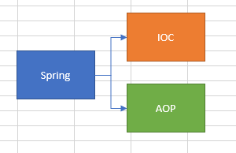
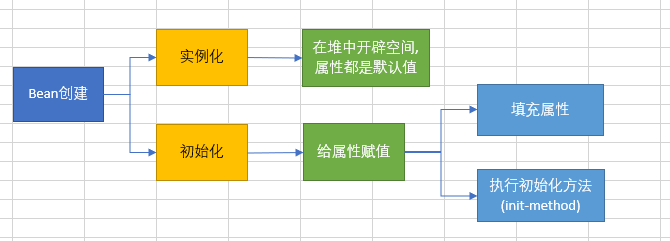
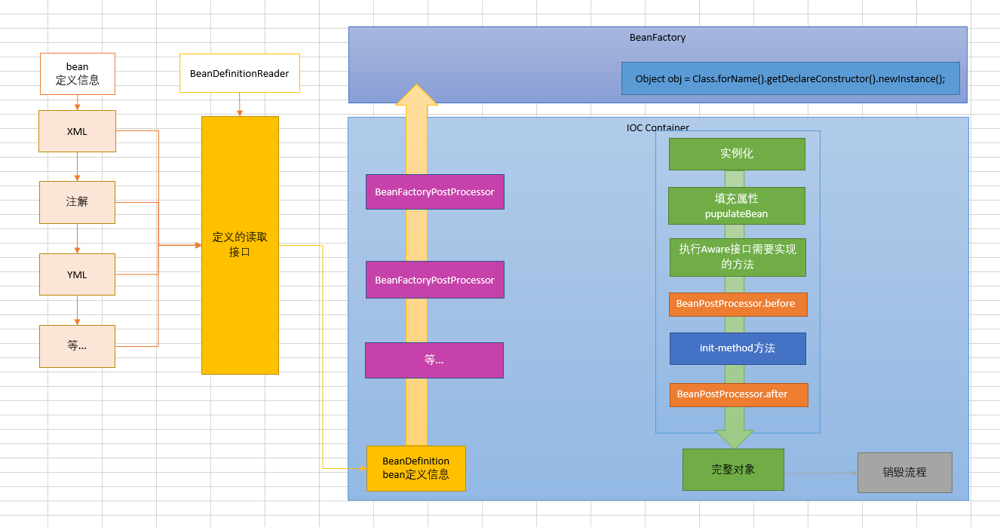
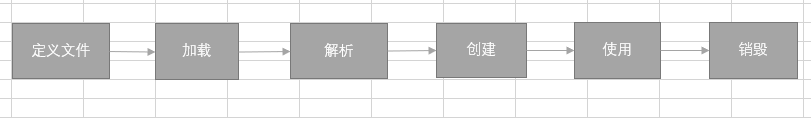

# Spring

## Spring

## Spring IOC

- IOC包含两个特性,控制反转和容器
    - 控制反转
        - 对象的创建由使用者变为Spring帮我们统一管理.
        - 依赖注入,把对应的属性注入到具体的对象中,通过@Autowire等注解设置,通过populateBean方法完注入
    - 容器
        - 存储对象,使用Map结构,在Spring中完整的对象存放在DefaultSingletonBeanRegistry.singletonObjects的map中.
- 大体流程
    - 首先创建一个Bean工厂,设置些参数.(一般使用实现类DefaultListableBeanFactory,BeanFactory是个顶级接口)
    - 加载解析Bean定义信息(xml,注解等),生成Bean的定义对象BeanDefinition
    - 完成BeanFactoryPostProcessor处理,提供的扩展点(PlaceHolderConfigurationSupport,ConfigurationClassPostProcessor)
    - 注册BeanPostProcessor,方便后续对Bean对象完成扩展功能
    - 利用反射的方式将BeanDefinition实例化成具体的Bean
    - 执行Bean的初始化,先填充属性,执行Aware子类方法,调用BeanPostProcessor前置方法,执行init-method方法,最后调用BeanPostProcessor后置方法
    - 完整的Bean创建完成,通过getBean即可获取
    - 销毁流程

## Spring AOP
    
- AOP是IOC的一个扩展点,先有IOC后有的AOP,只是在IOC的整个流程中,新增了一个扩展点BeanPostProcessor   
    - 在Bean创建的过程中对其进行扩展,具体是在BeanPostProcessor的后置处理方法
    - 代理对象的生成方式(advise,切面,切点)
    - 通过动态代理生成对象
        - JDK
        - CGLIB
    - 在执行方法的时候,通过DynamicAdvisedInterceptor类的intercept方法开始执行
        - 根据之前定义好的通知生成的拦截器链
        - 从拦截器链中依次获取每一个通知  
- 应用场景
    - 记录日志
    - 权限控制
    - 等... 
    
## Spring的事务是如何回滚的

- Spring的事务也是通过AOP来实现的,然后按照AOP的流程执行具体的操作逻辑,通过TransactionInterceptor来实现的
- 大体流程
    - 先做准备工作,解析方法上事务的相关属性,根据具体属性确定是否开启事务
    - 如需开启事务,则获取数据库连接后,关闭自动提交功能,开始事务
    - 完成具体的SQL逻辑操作
    - 如果发生异常,通过completeTransactionAfterThrowing来完成事务的回滚操作,回滚的具体逻辑是通过doRollBack方法来实现的,实现的时候也是要先获取连接对象,通过连接对象来回滚    
    - 如果正常完成,通过commitTransactionAfterReturning完成事务的提交操作,提交的具体逻辑通过doCommit方法来实现,实现的时候也是要先获取连接对象,通过连接对象来提交
    - 最后完成相关事务信息的清理cleanTransactionInfo
    
## BeanFactory和FactoryBean有什么区别 

- 相同点
    - 都可以用来创建Bean对象
- 不同点
    - 使用BeanFactory创建对象时候,必须要遵循严格的生命周期
    - Factory可以自定义某个对象的创建,同时创建完成交给Spring管理,实现FactoryBean即可
        - isSingleton():是否为单例
        - getObjectType():获取对象的类型
        - getObject():自定义创建对象的过程